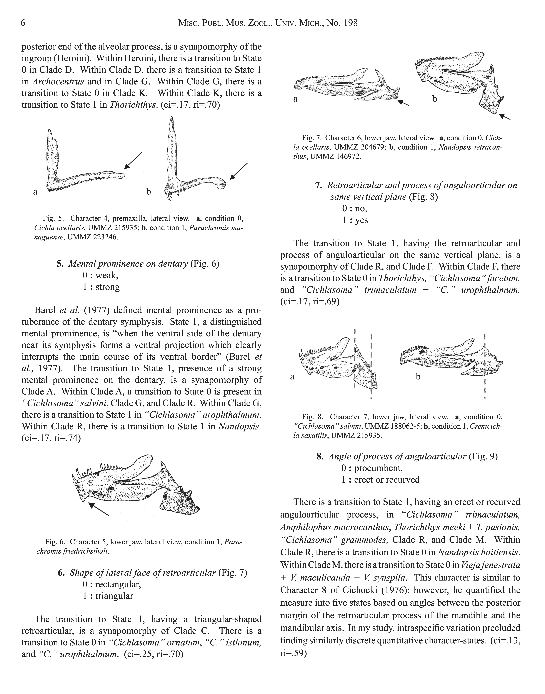

```{r setup, include=FALSE}
knitr::opts_chunk$set(
  echo = FALSE,
  warning = FALSE,
  message = FALSE,
  fig.align = "center",
  out.width = "100%"
)
# library(ggplot2)
# library(reshape2)
```

# Introduction

<!-- Background and motivation for the study -->

Phenotype annotations using ontologies are critical for integrating morphological data across taxa. Producing high-quality annotations requires significant domain expertise, yet the consistency and accuracy of both manual and automated approaches remain underexplored.

We evaluated annotation quality by comparing curator-generated and CharaParser-automated annotations against a Gold Standard dataset using ontology-based semantic similarity metrics.

# Evolutionary Character States

In comparative morphology, organisms are described using **characters** (observable anatomical features) and **states** (the specific forms a character takes across taxa). For example, a character might be "shape of the caudal fin" with states such as "forked" or "rounded." Character-state matrices underpin phylogenetic analyses and form the raw material for phenotype annotation.

<div style="float: left; width: 45%; margin: 0 1em 0.5em 0;">
```{r chakrabarty-fig, fig.cap="Examples of morphological characters and states from Chakrabarty (2007).", out.width="100%"}

```
</div>

Annotating character states with ontology terms (Entity-Quality, or EQ, statements) enables computational reasoning over phenotypic descriptions, linking free-text morphological observations to formal knowledge representations.

<div style="clear: both;"></div>

# Original Methodology

**Curators and Rounds.** Three curators (WD, AD, NI) each annotated the same set of characters in two rounds: a Naive Round (NR, no training) and a Knowledge Round (KR, after training).

**Automated Annotations.** CharaParser was used to generate automated annotations from the same character descriptions.

## Groupwise Semantic Similarity

Because annotations reference ontology terms, similarity between two annotations is not binary (match/no-match) but graded: terms that share more ontological ancestors are more semantically similar than terms that share fewer. We use two complementary measures computed over ontology-derived ancestor sets.

**Jaccard Similarity (SimJ).** For each pair of annotation classes, we compute the full set of ontological ancestors (superclasses via the ELK reasoner over a merged ontology of UBERON, PATO, BSPO, and GO), enriched with expressions materializing additional axes of classification based on relations (e.g., _part_of_). SimJ is the ratio of shared ancestors to total ancestors:

$$\text{SimJ}(A, B) = \frac{|Anc(A) \cap Anc(B)|}{|Anc(A) \cup Anc(B)|}$$

SimJ ranges from 0 (no shared ancestry) to 1 (identical ancestor sets). For each character-state, we take the maximum SimJ across all EQ pairings between the two annotation sets, capturing the best-case alignment.

**Normalized Information Content (NIC).** While SimJ treats all ancestors equally, NIC weights them by specificity. The Information Content of a term reflects how rarely it appears as an ancestor across the corpus: $IC(t) = -\log_2 \frac{freq(t)}{N}$. For each class pair, we identify the Most Informative Common Ancestor (MICA) and normalize:

$$\text{NIC}(A, B) = \frac{IC(\text{MICA}(A, B))}{IC_{\max}}$$

NIC complements SimJ by giving higher scores when two annotations share a specific, informative common ancestor rather than only broad, general ones.

## Partial Precision and Recall

A single character-state may be annotated with multiple EQ statements. To compare annotation sets of different sizes, we adapt precision and recall using best-match averaging over pairwise SimJ scores.

**Partial Precision** measures how well each curator/agent EQ is represented in the Gold Standard. For each EQ in the test annotation, we find its best SimJ match among the GS EQs and average:

$$PP = \frac{1}{|C|} \sum_{c \in C} \max_{g \in GS} \text{SimJ}(c, g)$$

**Partial Recall** measures how well each Gold Standard EQ is captured by the test annotation. For each EQ in the GS, we find its best SimJ match among the test EQs:

$$PR = \frac{1}{|GS|} \sum_{g \in GS} \max_{c \in C} \text{SimJ}(g, c)$$

High precision with low recall indicates the annotator produced correct but incomplete annotations; high recall with low precision suggests over-annotation or imprecise term selection.

# Extending with Agentic Annotation

<!-- Describe the AI agent annotation approach and how it parallels the original study design -->

We extend the original study by introducing AI agent annotators (Claude 4.6 and GPT 5.4) as additional participants, evaluated using the same metrics and Gold Standard. Like the human curators, the AI agents annotated in two rounds, enabling direct comparison across all annotator types.

# Results

<!-- Replace these placeholder sections with your actual results -->

## Semantic Similarity

```{r simj-plot, fig.cap="SimJ scores across curators and rounds.", fig.height=5}
# TODO: Add your SimJ figure here
# e.g., source("../src/figure3.R") or load saved plot objects
plot.new()
text(0.5, 0.5, "SimJ Figure Placeholder", cex = 1.5)
```

## Partial Precision and Recall

```{r pr-pp-plot, fig.cap="Partial Precision and Partial Recall by curator and round.", fig.height=5}
# TODO: Add your PP/PR figure here
plot.new()
text(0.5, 0.5, "PP/PR Figure Placeholder", cex = 1.5)
```

## Statistical Tests

<!-- TODO: Add summary of Wilcoxon signed-rank test results -->

# Discussion

<!-- Interpret the key findings -->

# Conclusions

<!-- Summarize the main takeaways -->

# References
